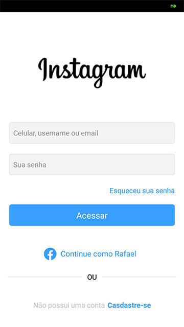
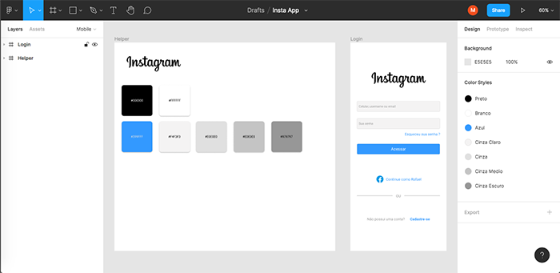

# React Native Tela clone do Instagram

## Resultado da ultima aula de React Native. 
Esta aplicação simples é resultado dos meus estudos em React Native, uma reprodução da tela do Instagram. E nesta aula, usamos o Figma, para fazer uma prévia da interface.

_____

_____
 Designer feito no Figma.

_____

## Licença:

[GNU General Public License v3.0](https://github.com/maroberto/React_Native_Calculadora/blob/master/LICENSE)
